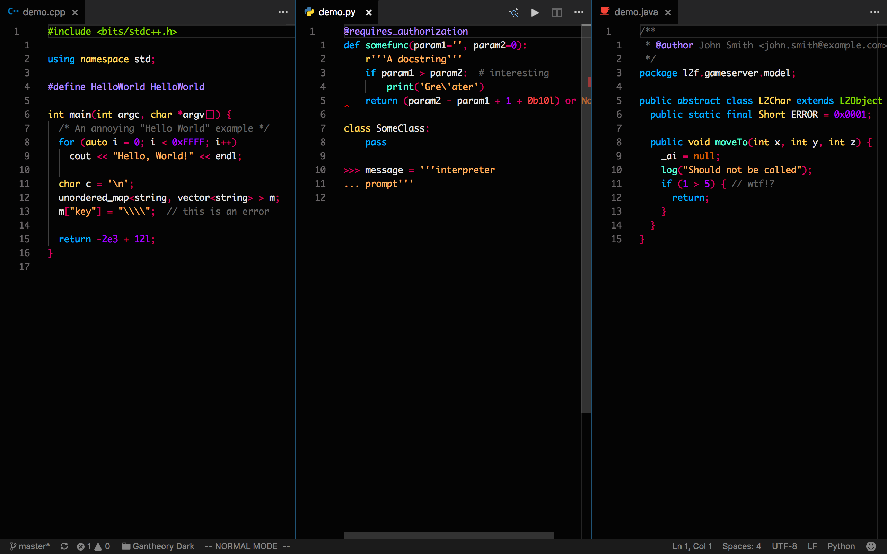

# vscode-theme-gantheory

Gantheory theme is a dark theme for Visual Studio Code.
This theme customizes colors in the editor, workbench and integrated terminal.

## Screenshot

## Issues

If you find some missing highlight or have any other suggestions of this theme, feel free to submit an issue!

## Contribution

Fork this repo and submit pull requests.

## Reference

* Dark+ (Visual Studio Code)
* Pikacode (Vim)
* Dark Gray (Code:Blocks)
* [Google Material Design](https://material.io/guidelines/style/color.html#)
